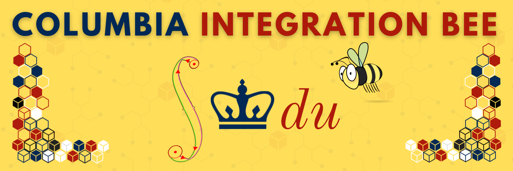

### Welcome to the Columbia Integration Bee contest page! 

The contest consists of two rounds, a **Qualifying Round** and a **Final Tournament**, as follows. 

### Qualifying Round 
In the qualifying round you will have one hour to solve as many integrals as you can from a list of 20+ integrals. Points are given only for complete, correct answers. Top 12 scores qualify for the single elimination round. The next four top scores are kept as reserves in case any of the top 12 are unable to attend.   

### Final Tournament 
The final tournament is based on a 12 player bracket style playoff, where the top four contestants in the qualifying round are given byes in the first round. Participants in the simple elimination round compete head-to-head, at the blackboard. The competitors in the final tournament receive consolation prizes. The winner will be awarded the title of **Columbia's Grand Integrator**!

## 2024 Columbia Integration Bee

- **Qualifying round:** Friday February 23rd from 5:00pm in 329 Pupin Hall 
- **Final tournament:** Friday March 1st at 5:00pm in 329 Pupin Hall

### 2024 Finalists & reserves will appear here

____
### FQA

- *Who can compete?*  
Any Barnard or Columbia undergraduate student.  
- *I missed the registration period. Can I compete?*  
No problem! Just drop by during the qualifying round.   
- *What to bring with me at the qualifying round? at the final tournament?*  
Bring a pencil at the qualifying round and ..some inspiration :) At the final tournament, bring your friends!  
- *What type of problems will I solve?*  
Integrals. 
- *Where I can find past qualifying tests?*  
For past qualifying tests see: [2022](/Columbia-Integration-Bee/2022/2022_qualifying.pdf) and [2022](https://github.com/georg271828/Columbia-Integration-Bee/blob/main/Columbia/2022/2022_qualifying.pdf) and [2023](https://github.com/georg271828/Columbia-Integration-Bee/blob/main/Columbia/2022/2023_qualifying.pdf). See more about the past competitions [here](./2022/2022_contest.html).
- *I want to help organize the next Integration Bee. Who do I contact?*   
Contact [George Dragomir](mailto:dragomir@math.columbia.edu?subject=Columbia%20Integration%20Bee).

_ _ _

#### Contact:   
 - For further inquiries, please contact [George Dragomir](mailto:dragomir@math.columbia.edu?subject=Columbia%20Integration%20Bee) 
    
