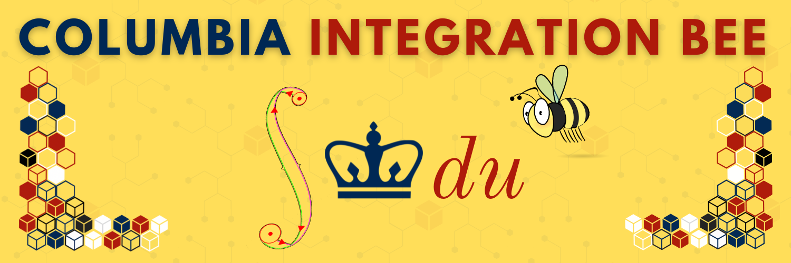

### Welcome to the Columbia Integration Bee contest page! 

The contest consists of two rounds, a **Qualifying Round** and a **Final Tournament**, as follows. 

### Qualifying Round 
In the qualifying round you will have **one hour** to solve as many integrals as you can from a list of 20+ integrals. Points are given only for complete, correct answers. Top 12 scores qualify for the single elimination round. The next four top scores are kept as reserves in case any of the top 12 are unable to attend.   

The qualifying test can be taken during any one-hour interval within the time window listed below.

### Final Tournament 
The final tournament is based on a 12 player bracket style playoff, where the top four contestants in the qualifying round are given byes in the first round. Participants in the elimination round compete head-to-head, at the blackboard. The competitors in the final tournament receive consolation prizes. The winner will be awarded the title of **Columbia's Grand Integrator**!

## 2025 Columbia Integration Bee

- **Qualifying round:** [2025](./2022/2025_qualifying.pdf) 
-  **Final tournament: Friday March 7 at 5:00pm in Havemeyer 309**   

## 2025 Finalists:

1. Andrii	Shypachov
2. Leo	Li 
3. Luke	Freed 
4. Eric	Shao 
5. **Srijan	Deoraj - [2025 Columbia Grand Integrator](./2022/2025 Integration Bee Finals.pdf)** 
6. Will	Li 
7. Felix	Liu 
8. Neilesh	Shrotri 
9. Daniel	Cheng 
10. Sharanya	Chatterjee 
11. Zachary	Klein 
12. Nikhil	Mudumbi 

### Reserves: 
13. Shreyas	Rajaram 
14. Dhruv	Yalamanchi 
15. Shreyas	Singh 
16. Mateo	Ramirez 

____
### FAQ

- *Who can compete?*  
Any Barnard or Columbia undergraduate student.  
- *I missed the registration period. Can I compete?*  
No problem! Just drop by during the **qualifying round**.   
- *What to bring with me at the qualifying round? at the final tournament?*  
Bring a pencil at the qualifying round and ..some inspiration :) At the final tournament, bring your friends!  
- *What type of problems will I solve?*  
Integrals. 
- *Where I can find past qualifying tests?*  
For past qualifying tests see: [2022](./2022/2022_qualifying.pdf), [2023](./2022/2023_qualifying.pdf), and [2024](./2022/2024_qualifying.pdf).
- *Where I can find past finalists?*   
See more about the past competitions and the winners [here](./2022/2022_contest.html).
- *I want to help organize the next Integration Bee. Who do I contact?*   
Contact [George Dragomir](mailto:dragomir@math.columbia.edu?subject=Columbia%20Integration%20Bee).

_ _ _

#### Contact:   
 - For further inquiries, please contact [George Dragomir](mailto:dragomir@math.columbia.edu?subject=Columbia%20Integration%20Bee) 
    
